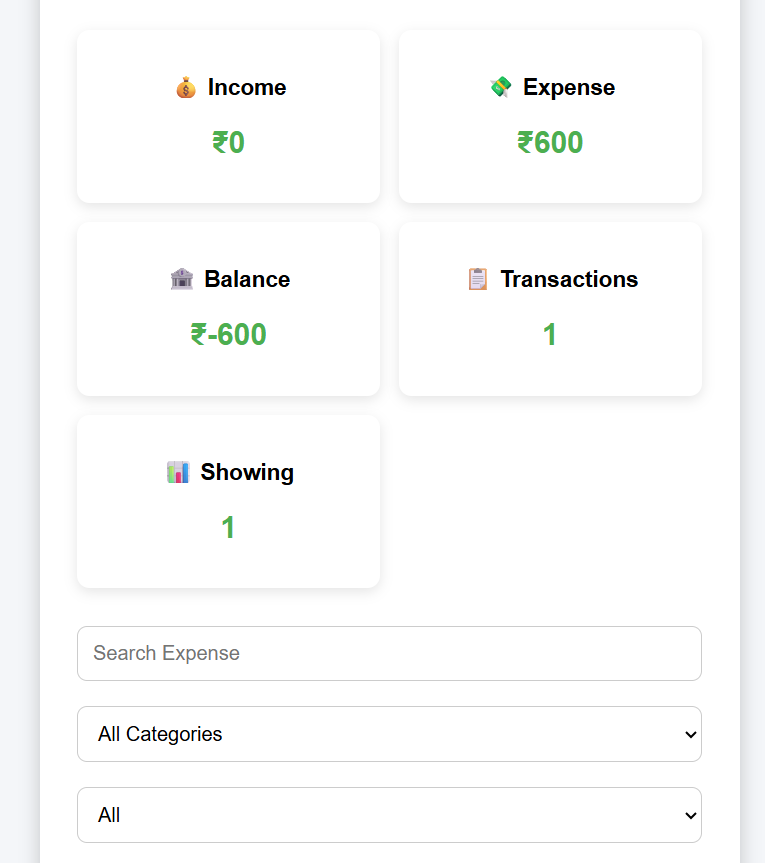
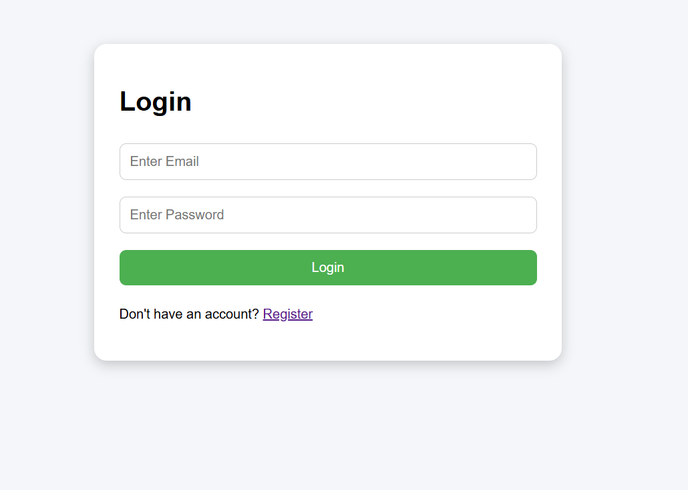
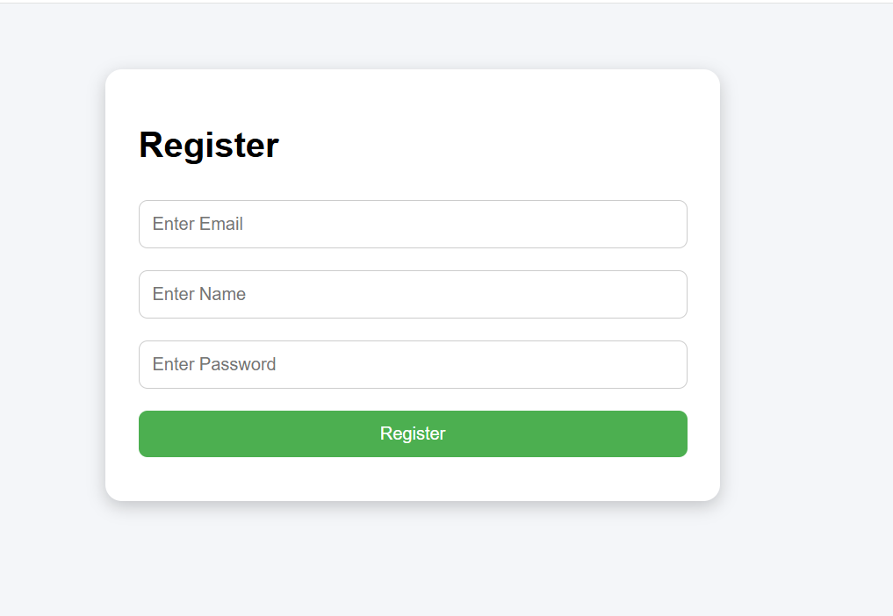
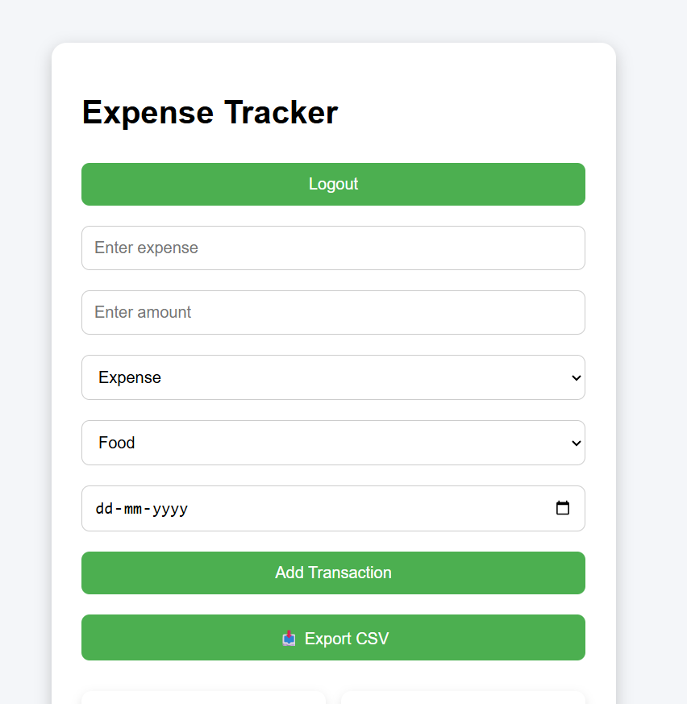
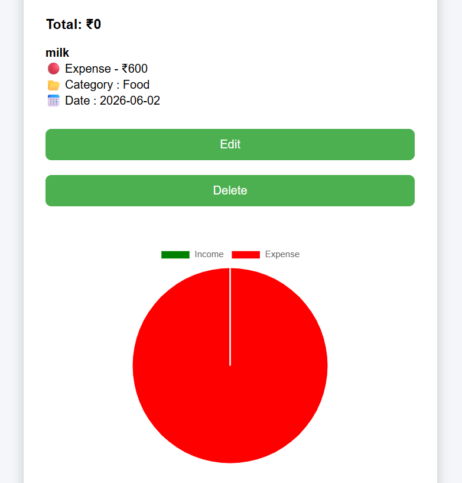

# 💰 Expense Tracker

A Full Stack Expense Tracker web application developed using Java Spring Boot, MySQL, HTML, CSS, and JavaScript.

## 📌 Project Overview

Expense Tracker is a web application that helps users manage their daily income and expenses. Users can register, log in, add transactions, edit or delete them, search expenses, view dashboard summaries, and export data to CSV.

## ✨ Features

- User Registration & Login
- Add Income & Expenses
- Edit & Delete Transactions
- Search Transactions
- Dashboard Summary
- User-wise Expense Management
- Export Expenses to CSV
- REST API Integration
- MySQL Database

## 🛠️ Technologies Used

### Backend

- Java
- Spring Boot
- Spring Data JPA
- Hibernate
- MySQL
- Maven

### Frontend

- HTML
- CSS
- JavaScript

### Tools

- Git
- GitHub
- Postman
- VS Code

## ⚙️ Installation

1. Clone the repository

```bash
git clone https://github.com/shivani432/ExpenseTracker.git
```

2. Open the backend project in your IDE.

3. Configure MySQL in `application.properties`.

4. Run the Spring Boot application.

5. Open the frontend (`index.html`) in your browser or using Live Server.

---

## 📂 Project Structure

```
ExpenseTracker/
│
├── backend/
│   ├── controller/
│   ├── service/
│   ├── repository/
│   ├── entity/
│   └── ...
│
├── index.html
├── script.js
├── style.css
├── login.html
├── register.html
└── README.md
```

---

## 📸 Screenshots

### Dashboard



### Login Page



### Register Page



### Add Transaction



### Expense Chart




## 👩‍💻 Author

**Shivani Kantak**

Java Full Stack Developer (Fresher)
  
📧 Email: shivanikantak10@gmail.com

🔗 GitHub: https://github.com/shivani432

🔗 www.linkedin.com/in/shivani-d-kantak

